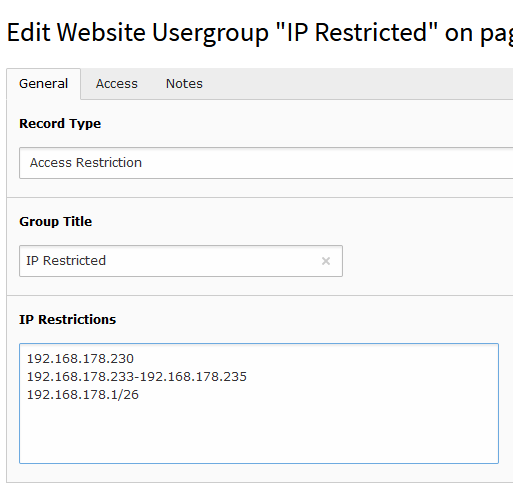

# TYPO3 Extension ``access_restriction``

> composer req hoogi91/access-restriction

## Features

* Supporting editors & authors by providing
    * IP restrictions of pages and content elements via:
        * single IP e.g. 192.168.0.1
        * IP range e.g. 192.168.0.1-192.168.0.255
        * IP subnet e.g. 192.168.0.1/24

## Contribution

**Pull Requests** are gladly welcome! Nevertheless please don't forget to add an issue and connect it to your pull requests. This
is very helpful to understand what kind of issue the **PR** is going to solve.

Bugfixes: Please describe what kind of bug your fix solve and give us feedback how to reproduce the issue.

Features: Not every feature is relevant for the bulk of users. It helps to have a discussion about a new feature before you open a pull request.